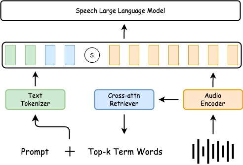

# Attention2Probability: Attention-Driven Terminology Probability Estimation for Robust Speech-to-Text System

<p align="center">
  <a href="https://arxiv.org/abs/2508.18701" alt="paper"></a>
  <a href="https://huggingface.co/ByteDance/Attention2Probability" alt="Model"></a>
  <a href="https://huggingface.co/datasets/ByteDance/Attention2Probability" alt="Dataset"></a>

Attention2Probability (A2P) is a lightweight intervention scheme for speech terminology. The core approach is to use the cross-attention mechanism to retrieve the terms that may appear in the audio and add these terms to the prompt of the llm to complete the term intervention.


## News
- [2025-08-14] We have released the train and infer code for A2P.

## Structure

The overall architecture of Attention2Probability. Audio features are extracted and then fed into a cross-attention retriever, which retrieves the Top-k terms with the highest probability of occurrence within the audio. These retrieved terms are concatenated with the prompt. Finally, the prompt and the audio features are jointly input into the speech large language model. 

<div align=center></div>

## Installation

A2P is implemented based on the open-source toolkit accelerate

  ```bash
  pip3 install -r requirements.txt
  ```

## Training

1. Download the data to ```/pathtodata```. It's important to change your audio path in json.
2. Download the model to `/path/pretrained-modelh`. Your can also download [Qwen2-Audio-Instruction](https://huggingface.co/Qwen/Qwen2-Audio-7B-Instruct) and split it to the audio_tower, projector and embedding.
3. Running with ```bash ./retriever/train.sh`` in A100-SXM-80GB.
4. For the dataset configuration, the phrase_type parameter can be adjusted to specify either word-level or phrase-level granularity. It should be noted that models for Chinese are generally trained only at the phrase-level, as word-level granularity is nonsensical for the Chinese language.

## Inference

1. Same as **Training: 1-2**.
2. Download the ckpt to ```ckpt```.
3. Running with ```python3 ./infer/infer.py --config ./infer/infer_config``` in A100-SXM-80GB. Now you can change the setting in the ```infer_config.json```. Enjoy yourself !


## Citation
If you find A2P useful, please cite the paper:
```
@inproceedings{
  dy2025attention,
  title={{Attention2Probability: Attention-Driven Terminology Probability Estimation for Robust Speech-to-Text System},
  author={Yangfan Du, Jun Zhang, Bin Wang, Jin Qiu, Lu Huang, Yuan Ge, Xiaoqian Liu, Tong Xiao, Jingbo Zhu},
}
```
